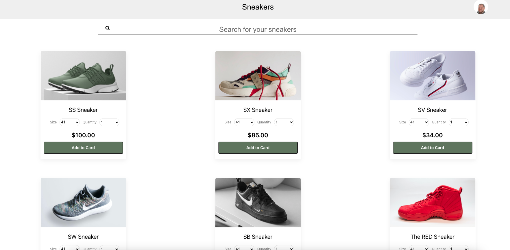

# Trustly Front-End Challenge
This is a project for a front-end challenge for Trustly. The application is a checkout of a sneakers store.

# Link to project
https://trustly-challenge-six.vercel.app/

# Setup on Terminal for Run Project Locally (fron-tend)
```terminal
git clone https://github.com/felipeeu/trustly-challenge.git
cd trustly-challenge
yarn install
yarn start
```


# Demo

## List of sneakers

## Checkout

## Select Bank

## Authenticate

## Return a PIN

## Account type

## Review and confirmation


### Tech

The project uses some technologies o work properly:
| Tech | Description |Documentation|
| ------ | ------ |------|
| ReactJS | a JavaScript library for building user interfaces|https://reactjs.org/|
| Styled Components | to write actual CSS code to style components|https://styled-components.com/|
| Axios | promise based HTTP client for the browser and node.js|https://github.com/axios/axios|
|Vercel | to deploy front-end|https://vercel.com|


## Create React App

This project was bootstrapped with [Create React App](https://github.com/facebookincubator/create-react-app). You can find more information on how to perform common tasks [here](https://github.com/facebookincubator/create-react-app/blob/master/packages/react-scripts/template/README.md).